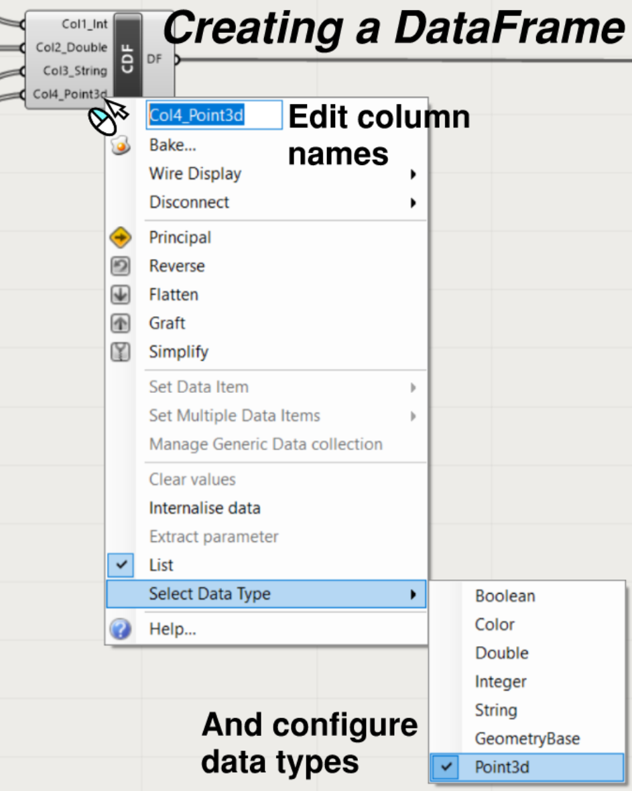

# BabyPanda

A library for working with tabular data in grasshopper. **WORK IN PROGRESS**

With other features like reading/writing to excel and svgs. Full list below...

# Current features
- Create DataFrame objects with an expandable component
- View DataFrame objects in a table editor. Edit DataFrames which are internalised parameters.
- Retrieve data from a DataFrame as a list of columns
- Read and write DataFrames to excel, in a live instance of the application
- Write C# with a modified version of the original C# script component. Modified C# script component comes with the relevant assemblies pre-referenced for convenient scripting experience.
- Generate svgs which can be used in synoptic panel

# Todo
1. Finish the BabyPanda.GHReflectionComponents to generate grasshopper components from C# classes.
2. Use BabyPanda.GHReflectionComponents to write components for the many DataFrame processing functions that are required. This includes:
	- Filtering numerical columns by threshold
	- Filtering text columns
	- Numerical operations on columns & between columns
	- Sorting rows by numerical values
	- Fill null values
	- Replace values
	- Promote first row as headers
3. Combine DataFrame functions such as:
	- Merge 
	- Join
4. Check C# scripting component points to the correct assemblies on different computers. May need to add a feature to automatically update assembly references.
4. Improve C# scripting experience with more helper functions etc...
